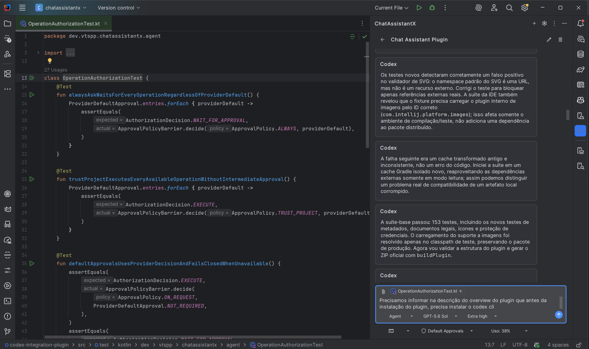
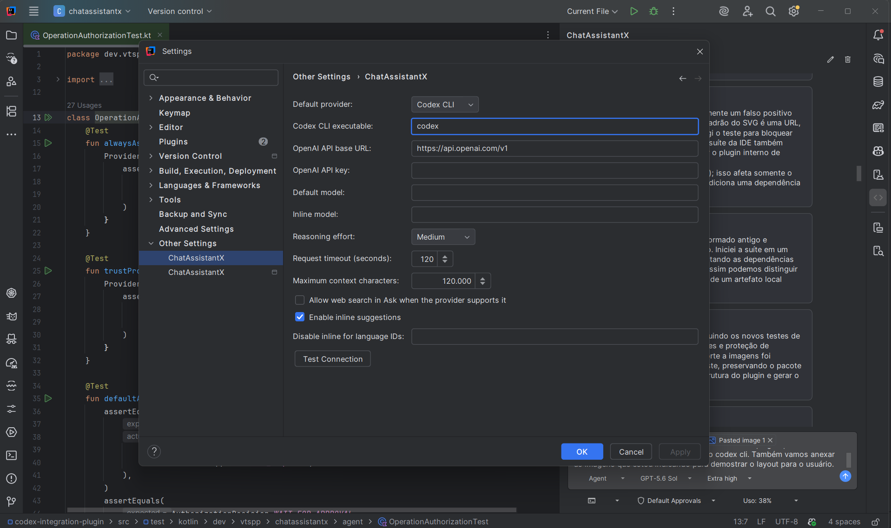
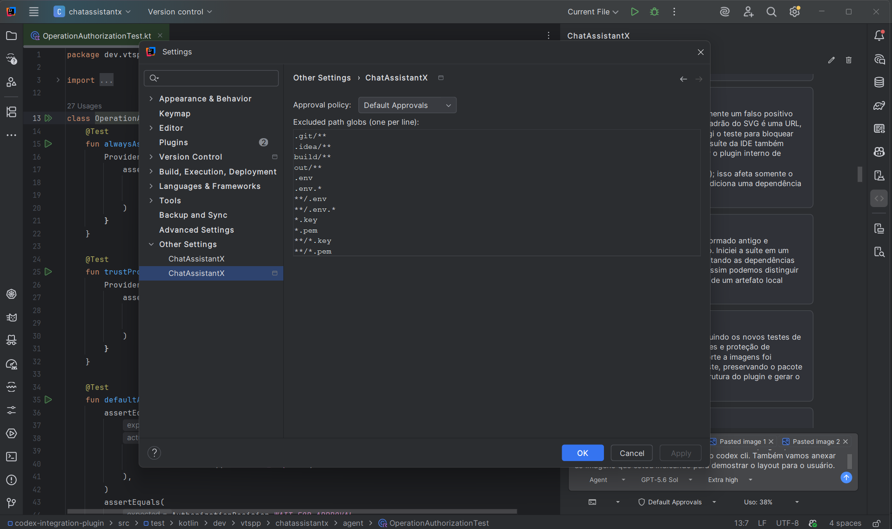

# ChatAssistantX for IntelliJ IDEA and Rider

Plugin nativo para IntelliJ IDEA e Rider que integra o Codex CLI e a OpenAI Responses API. A interface segue padrões conhecidos de assistentes de código, mas usa implementação e identidade próprias.

## Pré-requisito de instalação

Antes de instalar o ChatAssistantX, instale o [Codex CLI](https://developers.openai.com/codex/cli/) e conclua a autenticação:

```powershell
codex login
```

A integração com a OpenAI Responses API também é suportada e requer uma chave da OpenAI API. A chave não substitui o pré-requisito de instalação e autenticação do Codex CLI.

## Requisitos

- IntelliJ IDEA ou Rider 2024.2 ou mais recente.
- Java 21 para compilar o projeto.
- [Codex CLI](https://developers.openai.com/codex/cli/) instalado e autenticado com `codex login` antes da instalação do plugin.
- Chave da OpenAI API com acesso ao modelo configurado somente quando a integração `OPENAI_API` for utilizada.

## Recursos

- Chat lateral com streaming, histórico por projeto e modos Ask, Plan e Agent.
- Mensagens em balões separados, identificadas por `Codex`; enquanto uma resposta ainda não começou, o próprio cabeçalho do balão mostra `Codex - Thinking...`.
- Histórico de prompts da sessão no campo de chat: use `↑` e `↓` na primeira ou última linha para recuperar mensagens enviadas e restaurar o rascunho atual.
- Perguntas interativas quando uma decisão necessária estiver ausente, com opções recomendadas, resposta livre e retomada da mesma sessão.
- Ask pode consultar arquivos, diretórios, contexto da IDE, plano e anexos da sessão para responder sem alterar o projeto; Plan registra planejamento explícito no `plan.md` da sessão.
- Agent combina planejamento e execução: primeiro trabalha em modo somente leitura, apresenta uma proposta clara para `Aceitar e implementar`, `Adicionar informações` ou `Cancelar`, grava somente a revisão aceita no `plan.md` e então inicia automaticamente a implementação.
- Atualizações do mesmo assunto substituem apenas o bloco identificado pelo `topic-id`; solicitações diferentes criam novos blocos e preservam o restante do histórico.
- Ferramentas de leitura para arquivos, listagem, busca e inspeção da seleção, arquivo atual e abas abertas. Escrita e execução permanecem bloqueadas no Ask.
- Suporte independente de linguagem para projetos JVM e soluções .NET/C# abertas no Rider.
- Comandos `/new`, `/explain`, `/fix`, `/tests`, `/review`, `/docs` e `/compact`.
- Preview e aplicação de unified diffs com validação de paths e integração ao undo da IDE.
- Ferramentas de agente para leitura, listagem, busca, patches e comandos.
- Política de aprovação configurável por sessão, aplicada antes das operações instrumentais.
- Sugestões inline com aceite nativo da IntelliJ.
- Escolha entre Codex CLI e Responses API, modelos separados para chat e inline completion, e níveis de raciocínio Low, Medium, High e Extra high.

## Interface

### Conversa



Conversa com respostas identificadas como `Codex` e controles do modo Agent.

### Configurações do provedor



Configurações do Codex CLI e da integração com a OpenAI Responses API.

### Configurações do projeto



Política de aprovação e globs de caminhos excluídos do projeto.

## Configuração

Abra **Settings | Tools | ChatAssistantX**:

1. Escolha `CODEX_CLI` ou `OPENAI_API`.
2. Para CLI, informe o executável (por padrão, `codex`) e use **Test Connection**.
3. Para API, informe a URL base, a chave e o modelo. A chave é salva exclusivamente no `PasswordSafe` da IDE.
4. Configure o modelo de inline completion, limites de contexto e timeout.
5. Opcionalmente, habilite **Allow web search in Ask when the provider supports it** para permitir pesquisa web no Ask com a OpenAI Responses API. A opção permanece desativada por padrão.

As preferências iniciais e paths excluídos ficam em **Settings | Project | ChatAssistantX**. A política escolhida no compositor é persistida na sessão ativa.

| Política | Comportamento |
| --- | --- |
| `Default Approvals` | Usa o padrão de aprovação do provedor. Solicitações emitidas pelo provedor suspendem a operação até `Aprovar` ou `Recusar`; ausência de um padrão utilizável falha de forma fechada. |
| `Always ask` | Solicita aprovação individual antes de cada leitura, listagem, pesquisa, ferramenta, comando, alteração, acesso externo ou ação da IDE. A decisão vale somente para a operação e argumentos exibidos. |
| `Trust project` | Após uma advertência explícita, executa sem novas confirmações todas as operações disponibilizadas pelo modo atual, dentro ou fora do projeto, usando o sandbox mais amplo suportado pelo provedor. |

`Trust project` é uma permissão irrestrita apesar do nome: pode alcançar rede, processos, arquivos sensíveis, caminhos externos e ações destrutivas quando a ferramenta, o sistema operacional e o provedor permitirem. Ele não acrescenta ferramentas aos modos Ask, Plan ou Agent e não supera limitações técnicas da plataforma.

## Uso

- Abra **Tools | Open ChatAssistantX** ou a tool window **ChatAssistantX**.
- O campo de conversa preserva o texto de entrada `Ask Codex`, sem alterar a identidade comercial `ChatAssistantX` do plugin.
- Use **Attach Current** para anexar seleção/arquivo e **Attach Open Files** para anexar as abas abertas.
- No editor, abra **ChatAssistantX** no menu de contexto para explicar, corrigir, revisar, documentar ou gerar testes.
- Revise patches antes de aplicar. Alterações são executadas como um comando da IDE e podem ser desfeitas.
- No modo Agent, confirme a proposta antes da implementação. Se houver conflito ou mais de uma interpretação possível, escolha a regra que deve prevalecer; a opção de implementação permanece bloqueada até a ambiguidade ser resolvida.
- Pressione `Enter` para enviar e `Shift+Enter` para inserir uma nova linha.

## Privacidade e segurança

- O conteúdo anexado, os resultados de consultas e os prompts são enviados apenas ao provedor selecionado. O conteúdo integral retornado pelas ferramentas de leitura não é duplicado no histórico persistido.
- As interações são armazenadas em `~/.chatassistantx/sessions/<uuid>/`, com planos, contextos, imagens e definições de agentes isolados por sessão.
- Na primeira inicialização, o plugin cria diretamente `~/.chatassistantx`, `storage.json` e `sessions/`; dados já presentes nesse diretório são preservados e carregados normalmente.
- Imagens e contextos persistidos são mantidos em arquivos próprios, e não incorporados ao JSON da conversa.
- A chave da API não é gravada em arquivos de configuração, histórico ou logs.
- Fora de `Trust project`, paths fora do projeto e paths excluídos são bloqueados nas ferramentas internas. Em `Trust project`, ferramentas que aceitam paths absolutos podem operar fora da raiz.
- `.env`, chaves privadas, metadata da IDE e diretórios de build são excluídos por padrão.
- O plugin não adiciona telemetria.
- O adaptador CLI preserva o padrão nativo em `Default Approvals`, usa uma política interativa em `Always ask` e ativa `--dangerously-bypass-approvals-and-sandbox` somente após a confirmação de `Trust project`.

Para fazer backup das interações, copie o diretório `~/.chatassistantx`. A exclusão de uma sessão pela interface move seus dados para `~/.chatassistantx/trash`, permitindo recuperação manual.

## Limitações atuais

- A qualidade e latência de sugestões inline dependem do modelo e provedor configurados.
- Ask e Plan continuam limitando suas ferramentas mesmo com `Trust project`; Agent usa `workspace-write` nas políticas interativas e o acesso máximo suportado quando `Trust project` está ativo.
- O catálogo de modelos e alguns recursos dependem da versão instalada do Codex CLI e da conta OpenAI.
